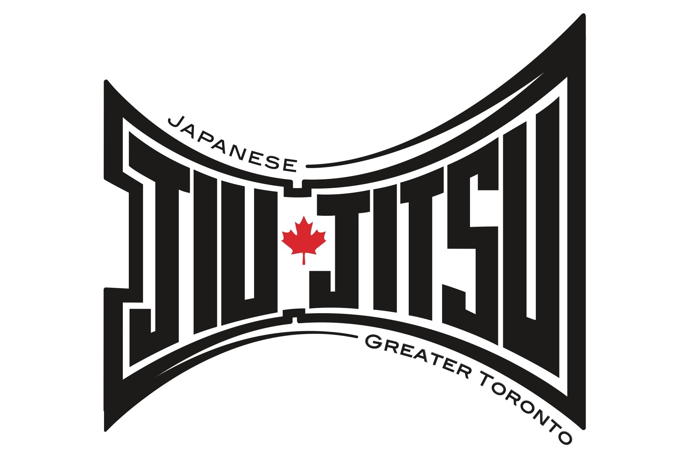
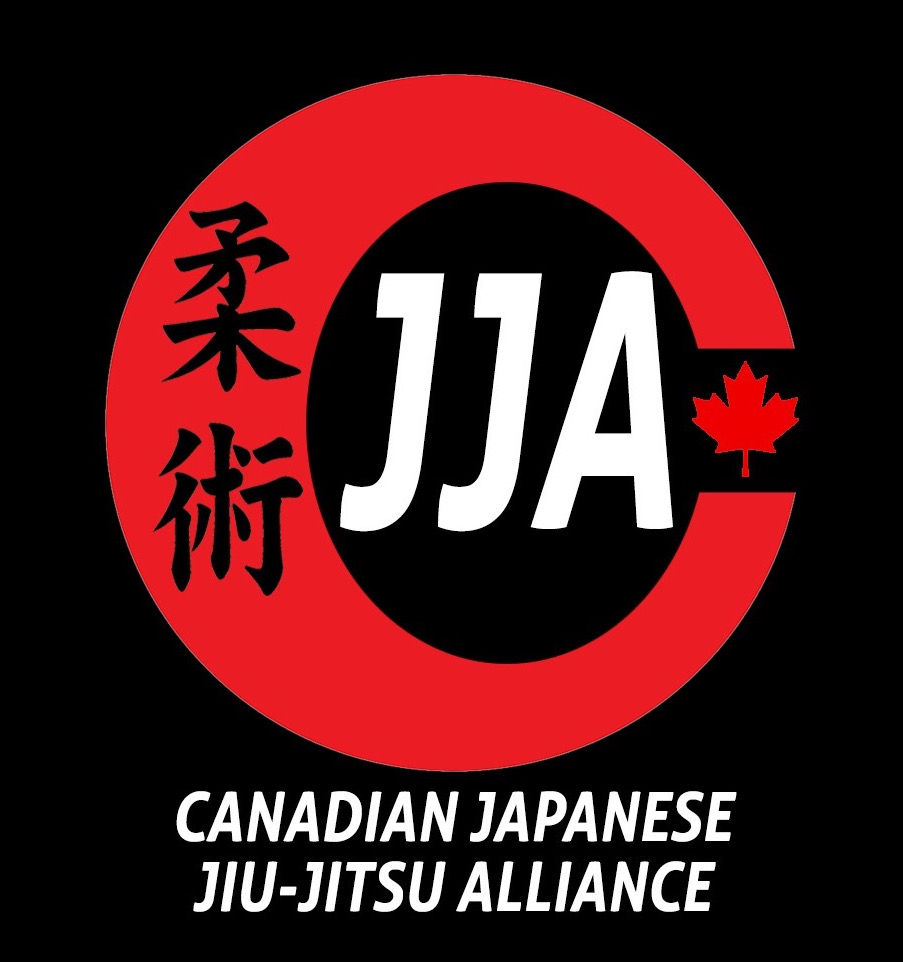

{:refdef: style="text-align: center;"}
{: width="450px";"}
{: refdef}

<strong>**MISSION STATEMENT**</strong>
{: style="color:gray; font-size: 200%; text-align: center;"}
**Our mission is to take the ancient battlefield art of Japanese Jiu-Jitsu and transform it into Self Defense for modern times, so that our students — men, women and children — can walk the streets with confidence. This mission will be accomplished with dedication, respect and humility.**
{: style="color:gray; font-size: 150%; text-align: center;border-style: solid;"}

# WELCOME TO GREATER TORONTO JIU-JITSU!
Founded by [Shihan Neil Dalgarno](/Instructors) in 1990, Greater Toronto Jiu-Jitsu has become the leading center for Japanese Jiu-Jitsu and Self Defense in the GTA. Neil began his training in the 1980’s under the legendary Tom Sharkey, a former Special Forces U.S. Ranger. After grading for Shodan in 1990, Neil began teaching in the GTA, most notably at the Toronto Police College. Neil, who holds a 6th Dan in Japanese Jiu-Jitsu, also has an honours degree in Kinesiology and a Bachelor degree in Education. Neil is an **Ontario Certified Teacher** and Fitness Professional. With numerous National Coaching Certifications, Neil has coached athletes who have become National team members and Olympic medalists.

[Shihan Neil, along with head instructors, Renshi Tony Richardson  5th Dan and Renshi O’Neil Anderson 5th Dan](/Instructors), have produced some of the country’s finest young martial artists. As well as producing a number of Jiu-Jitsu champions, Greater Toronto Jiu-Jitsu can even boast that Carlos Newton, a former UFC Champion, is one of its Black Belt graduates!

Our training facilities are world class! Greater Toronto Jiu-Jitsu classes are held at the Centre for Martial Arts, in Richmond Hill, Ontario. Our shared facility boasts, four dojos (training halls), spacious change-rooms with showers and a welcoming reception area.

{: width="120px"}{:class="image-right"}
Greater Toronto Jiu-Jitsu is affiliated with the Canadian Japanese Jiu-Jitsu Alliance (CJJA) and the World Kobudo Federation (WFK). All new black belts are graded under the CJJA. The WKF, regularly hosts National and International seminars, designed to bring together the best martial artists from around the globe.
   

# Curriculum
{: width="250px"}{:class="image-left"}

Having over 30 years of teaching experience in Toronto schools, Shihan Neil incorporates sound pedagogy at every level of Jiu-Jitsu instruction. Also, having special education qualifications, allows him to better serve students of different abilities and challenges.

Greater Toronto Jiu-Jitsu offers [separate classes for beginner, intermediate and advance children](/Schedule). After the age of 16, students, regardless of ability are encouraged to attend adult classes. Accommodations are often made to better serve the individual needs of students and parents.

Our Japanese Jiu-Jitsu program allows students to progress through the traditional Japanese grading system. Students begin as white belts and as they gain competency at various [belt levels (yellow, orange, green, blue and brown)](/Syllabus), will after four to five years, earn their Black Belts! All classes emphasize fitness, fun, confidence building and discipline. Adult classes focus on MMA skills and self defense. MMA skills include components of boxing, Muay Thai, judo and BJJ. Our self defense syllabus is similar to police and military programs worldwide.

# Self Defense and Personal Safety Training
{: width="600px"}{:class="image-left"}

Thousands of high school students, professionals and members of the general public, have benefitted over the years from our Self Defense and Personal Safety Seminars. Both [Shihan Neil and Renshi Tony](/Instructors) worked closely with the Toronto Police Service, as self defense instructors with the “Improve Program”. Neil and Tony were presented with “Certificates of Recognition” by Deputy Chief Sloly.
Self Defense Seminars, group or private lessons are available. [Please contact us at greatertorontojj@gmail.com](/contact)

The Canadian Japanese Jiu-Jitsu Alliance is a governing body, whose aim is to promote excellence in Japanese Jiu-Jitsu. Training seminars and promotions are available throughout Canada to all martial artists who share our passion with Japanese Jiu-Jitsu.

# History of Jiu-Jitsu
{: width="250px"}{:class="image-right"}

Unlike many martial arts, Japanese Jiu-Jitsu has not had a neat and well organized history, therefore its roots have been very difficult to trace. Mentioned as far back as 2500 years ago, Japanese Jiu-Jitsu developed from many individual teachings, either originating in japan or coming to Japan from other Asian countries. The first formal school opened in 1532 in Japan and the art itself became an important part of Samurai training. Jiu-Jitsu is often called the “parent art”, since many other arts like BJJ, Judo and Aikido can trace direct lines to Japanese Jiu-Jitsu.

Japanese Jiu-Jitsu is the most practical martial art! It is taught to police and military personnel throughout the world. The reason for this simple. Japanese Jiu-Jitsu is the original Mixed Martial Art (MMA)!
Japanese Jiu-Jitsu contains elements of striking, takedowns, and BJJ/grappling, making it the favoured art, not only of professional fighters, but people interested in defending themselves in any situation!

 
 
<iframe width="560" height="315" src="https://www.youtube.com/embed/39MV6JOP4XI" frameborder="0"></iframe>

 
 
 
 
 
